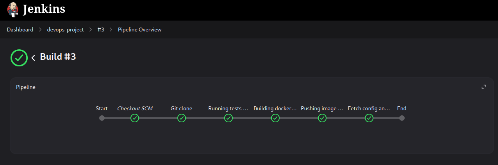
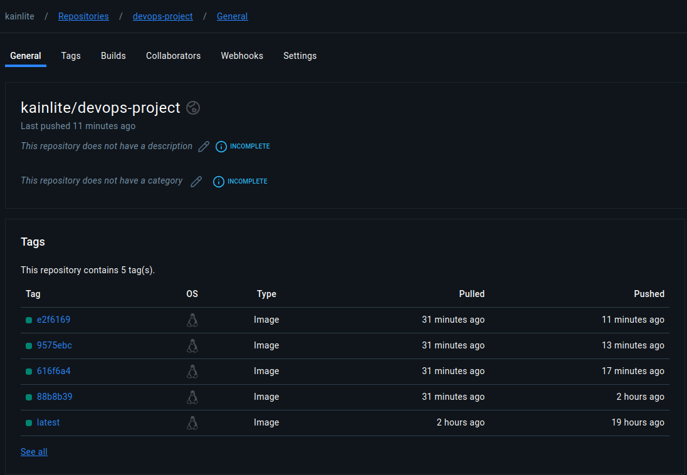
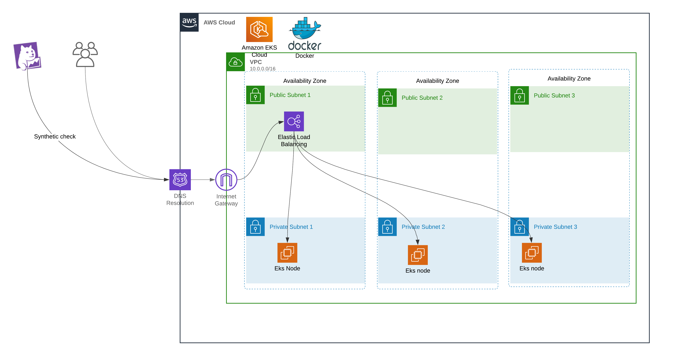
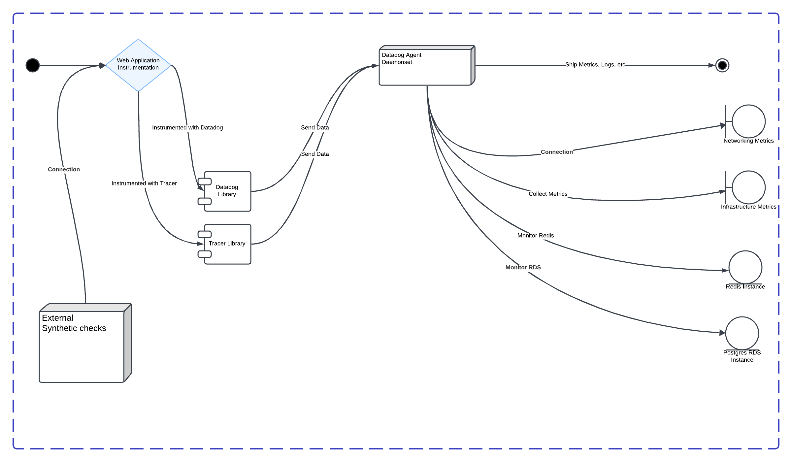

## DevOps Example project

This project has a webserver with some dependencies, along with the terraform code necessary to create the
infrastructure necesary to run it, and the manifests that can be used to deploy it to Kubernetes.

### Jenkins pipeline
Basic pipeline that builds, tests and pushes an image to dockerhub, and then deploys it to an EKS cluster.

### Docker Hub repository
Necessary to host the images.

### Terraform
The terraform code will create a very naive and basic EKS deployment using a single node group that resembles this
diagram.

Some possible improvements for continuos delivery and deployment:
* ArgoCD
  * ArgoCD Image Updater
  * Kargo (GitOps friendly)

### Monitoring
Observability and monitoring is key in any modern deployment, the strategy suggested to monitor this application is
described in the following diagram, using DataDog we can collect metrics, traces and logs.

* Instrument the application 
* Install and configure the tracer 
* Configure the agent as a Daemonset
  * Collect logs from pods
  * Collect network traffic information
  * Collect infrastructure metrics
* Configure additional agent 
  * Monitor RDS instance
  * Monitor Elasticache redis instance
* Configure alerts using the metrics and information available, some examples:
  * When synthetics fails for some given period 
  * Too many errors (400s, 500s).
  * App Latency
  * Use specific app metrics to produce additional alerts as needed
* External synthetic checks from multiple locations
* Review often and adjust as needed.

